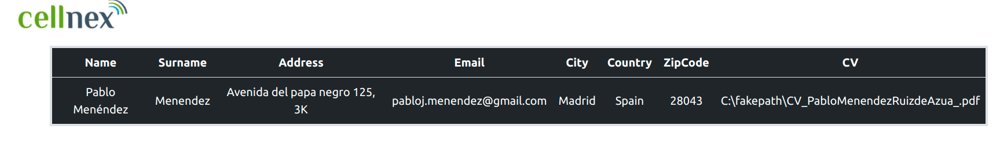
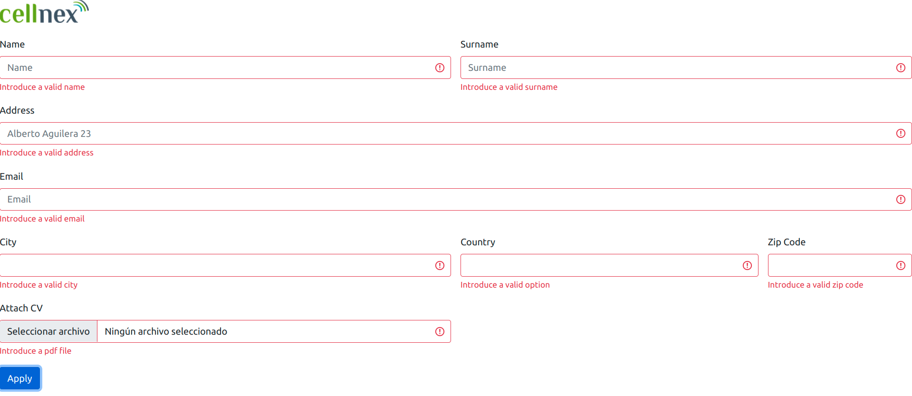
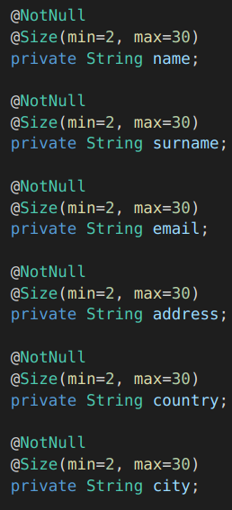
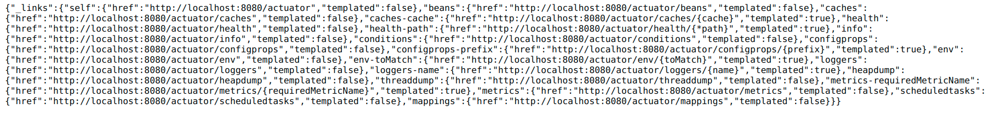
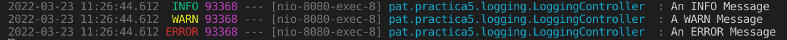

# Práctica 5 PAT - API-REST local
Esta página consiste en un formulario de solicitud de un trabajo en Cellnex. Los aplicantes rellenan un formulario con sus datos, que se guardan en una API Rest. Esta API puede ser accedida por los recruiters para ver los usuarios que han aplicado a los puestos.

# Ver la práctica

# Objetivo de la práctica

Reutilizando la practica de html o css, conecta el formulario de contacto con un endpoint implementado con Spring Boot

# Explicación de la práctica
El usuario una vez corra la aplicación se encontrará con una página en la que se oferta un trabajo en Cellnex. Si es un aplicante podrá rellenar un formulario, cuyos datos se almacenarán en el fichero aplicantes.json (ya que no tenemos una base de datos en la que almacenarlos). Si la persona que accede a la aplicación es un recruiter, podrá acceder a la información de los aplicantes cargándola del fichero aplicantes.json.

# Extras

- Utilizo un fichero json para almacenar los datos que escribe el usuario y poder mostrarlos por pantalla al recruiter. El fichero json es el que se llama applicantes.json.

- Establezco una validación en el lado del cliente (validación en javaScript), en la que no se acepta el formulario hasta que todos los campos están cumplimentados y de manera correcta.

- Además establecemos una validación en el lado del servidor, utilizando la validación de Springboot

- Actuator. Permite comprobar el estado de la página. Si accedemos a /actuator podremos ver el estado general de la web y ver sus datos.

- Logging. He incluido unos loging de prueba que se ejecutan al abrir localhost:8080/logs. Simplemente a modo de entender como funcionan los logs por consola.

